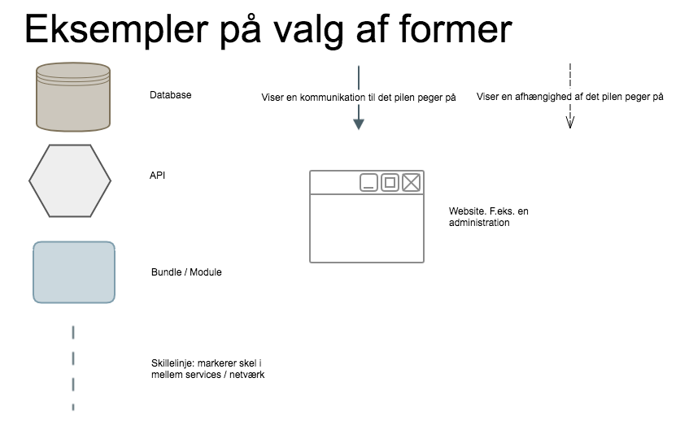

# Arkitekturtegninger

## Information

__Metodeansvarlig__: Troels Ugilt Jensen

__Overordnet formål__: At få ensrettet hvordan vi tegner arkitekturtegninger.

__Afgrænsning af metode__: Beskæftiger sig ikke med UML diagrammer, men tegninger af overordnet arkitektur.

## Regel 1 - Former

Vi bruger nogle faste former for at symbolisere forskellige elemeneter i en arkitekturtegning.

## Regel 2 - 
