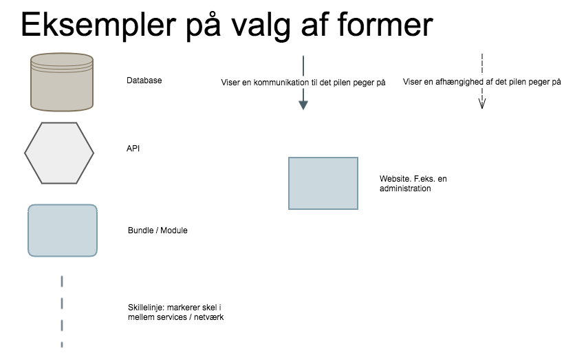
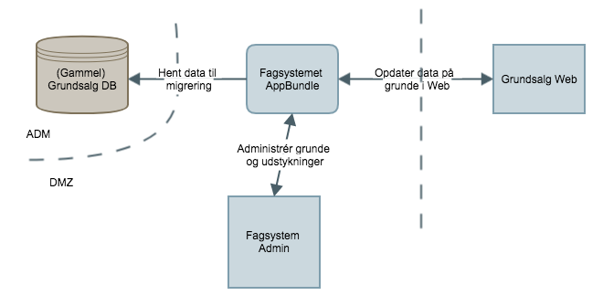

# Arkitekturtegninger

## Information

__Metodeansvarlig__: Troels Ugilt Jensen

__Overordnet formål__: At få ensrettet hvordan vi tegner arkitekturtegninger.

__Afgrænsning af metode__: Beskæftiger sig ikke med UML diagrammer, men
tegninger af overordnet arkitektur.

## Regel 1 - Formål

Formålet med arkitekturtegningerne er at lave en fælles platform at snakke om
et projekt ud fra. Derudover er det godt til at skitsere eksterne afhængigheder.

Formålet er også at bruge arkitekturtegningerne til at holde hinanden op på
aftaler der er lavet i starten af et projekt.

## Regel 2 - Håndtegnet eller på computer

Ofte er det fint at have en håndtegnet arkitekturtegning i de tidlige stadier
af et projekt. Det kan være givtigt at få rentegnet arkitekturen når projektet
skal realiseres og i kommunikation med kunden.

## Regel 3 - Former

Vi bruger nogle faste former for at symbolisere forskellige elemeneter i en
arkitekturtegning.

Husk at skrive hvad de forskellige pile illustrerer.

## Regel 4 - Eksempler

